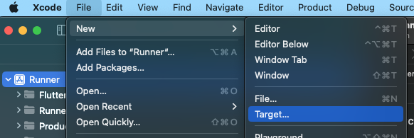
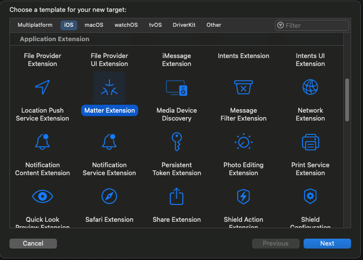
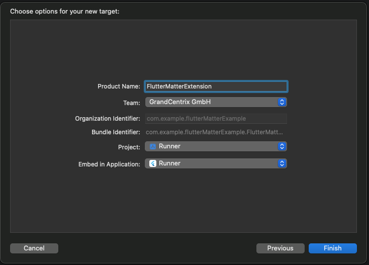
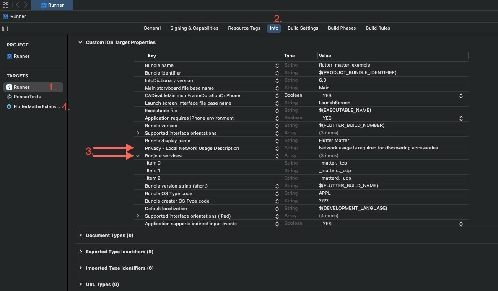
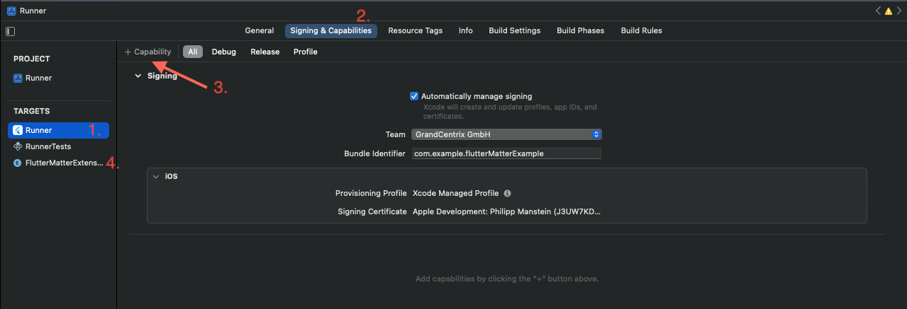
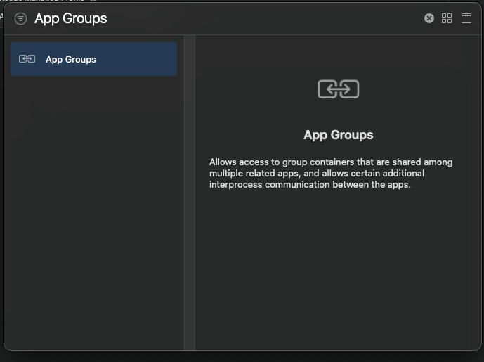
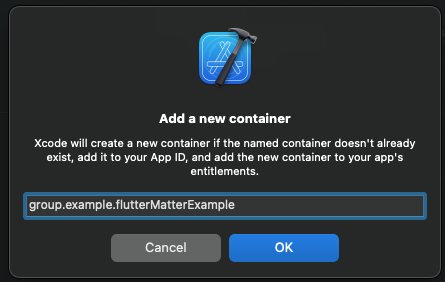
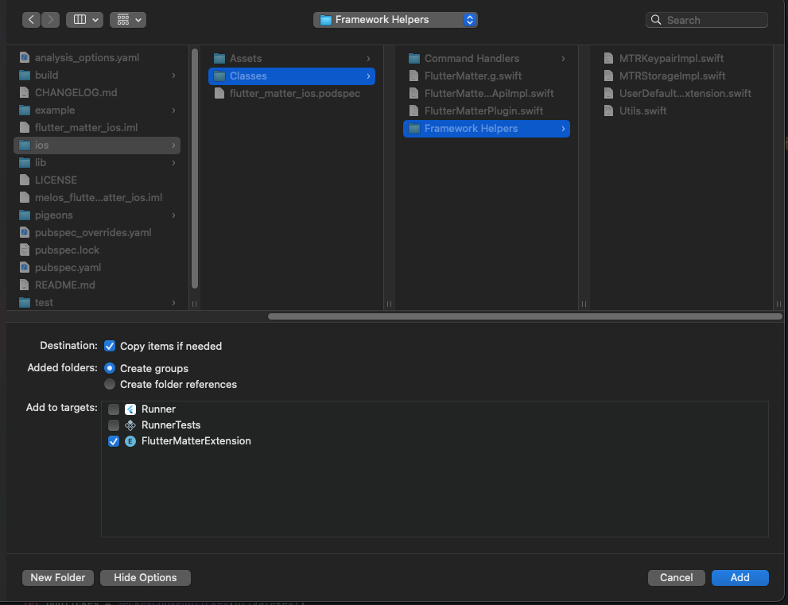

# flutter\_matter

Commission, control and share matter devices.

## Platform Support

This plugin needs at least Android 8.1 (API level 27) and iOS 16.4+ 

| Feature                | Android | iOS |
| :--------------------: | :-----: | :-: |
| Commissioning          | ✅      | ✅  |
| Control On/Off cluster | ✅      | ✅  |
| Share                  | ✅      | ✅  |
| Unpair                 | ✅      | ✅  |

## Quickstart 

1. Add a `dependency` on `flutter_matter: ^0.0.1`.
2. See [Setup for Android](#setup-for-android) and [Setup for iOS](#setup-for-ios)
3. Add an import for `package:flutter_matter/flutter_matter.dart`.
4. Use flutter_matter in your code:
```dart
import 'package:flutter_matter/flutter_matter.dart';

// IMPORTANT: Change the parameter `appGroup` to your App Group defined in the iOS App Group capabilities. See the README for setup!
final flutterMatterPlugin = = await FlutterMatter.createInstance(
      appGroup: 'group.example.flutterMatterExample');

// Commission a device
try {
    final device = await flutterMatterPlugin.commission(deviceId: 123);
    print('Comissioned $device');
} catch (e) {
    print('Error: $e');
}

// Send toggle command on on/off cluster
try {
    await _flutterMatterPlugin.onOffCluster.toggle(
        deviceId: 123,
        endpointId: 1,
      );
    print('Toggeld on/off cluster for device id 123 and enpoint id 1');
} catch (e) {
    print('Error: $e');
}
```

### Setup for Android

1. Add permissions to your `AndroidManifest.xml` and don't forget to include the tools namespace in the `manifest`-Tag `xmlns:tools="http://schemas.android.com/tools"`:
```xml
<manifest xmlns:android="http://schemas.android.com/apk/res/android"
    xmlns:tools="http://schemas.android.com/tools">

    <!-- BluetoothLE (BLE) -->
    <!-- https://developer.android.com/reference/android/bluetooth/le/BluetoothLeScanner#startScan(java.util.List%3Candroid.bluetooth.le.ScanFilter%3E,%20android.bluetooth.le.ScanSettings,%20android.bluetooth.le.ScanCallback)  -->
    <!-- Android Q (28) or later must have ACCESS_FINE_LOCATION -->
    <uses-permission android:name="android.permission.ACCESS_FINE_LOCATION"
        tools:ignore="CoarseFineLocation" />
    <!-- Needed for <= Build.VERSION_CODES#R (30) (only needed in Manifest) -->
    <uses-permission android:name="android.permission.BLUETOOTH_ADMIN" />
    <!-- Needed for >= Build.VERSION_CODES#S (31) (must be requested) -->
    <uses-permission android:name="android.permission.BLUETOOTH_SCAN" />
    <uses-feature
        android:name="android.hardware.bluetooth_le"
        android:required="true" />

    <!-- Wi-Fi Scan -->
    <uses-permission android:name="android.permission.CHANGE_WIFI_STATE" />
    <uses-permission android:name="android.permission.ACCESS_WIFI_STATE" />

    <!-- TODO: clarify what specifically requires the permission -->
    <uses-permission android:name="android.permission.BLUETOOTH" />
    <uses-permission android:name="android.permission.CAMERA"/>
    <uses-feature android:name="android.hardware.camera.any" android:required="false" />
    <uses-permission android:name="android.permission.INTERNET" />
    <uses-permission android:name="android.permission.CHANGE_WIFI_MULTICAST_STATE" />
    <uses-permission android:name="android.permission.NFC" />
    [...]
</manifest>
```

2. Add the commissioning service to your `AndroidManisfest.xml`:
```xml
<manifest xmlns:android="http://schemas.android.com/apk/res/android"
    xmlns:tools="http://schemas.android.com/tools">
    [...]
    <application
            [...] >
        [...]
        <service
            android:name="net.grandcentrix.flutter_matter.commissioning.AppCommissioningService"
            android:exported="true" />
        [...]
    </application>
</manifest>
```

3. To enable linking the app add the following `intent-filter` to your `AndroidManifest.xml`:
```xml
<manifest xmlns:android="http://schemas.android.com/apk/res/android"
    xmlns:tools="http://schemas.android.com/tools">
    <application
            [...] >
        <activity
            [...] >
            [...]
            <intent-filter>
                <action android:name="com.google.android.gms.home.matter.ACTION_COMMISSION_DEVICE" />
                <category android:name="android.intent.category.DEFAULT" />
            </intent-filter>
        [...]
        </activity>
    </application>
</manifest>
```

4. Change kotlin version in your `build.gradle` for the project to at least `1.9.0`:
```gradle
buildscript {
    ext.kotlin_version = '1.9.0'
    [...]
}
```

5. Set your `minSdkVersion` to at least `27`:
```gradle
android {
    [...]

    defaultConfig {
        [...]
        // You can update the following values to match your application needs.
        // For more information, see: https://docs.flutter.dev/deployment/android#reviewing-the-gradle-build-configuration.
        minSdkVersion 27
        targetSdkVersion 33
        [...]
    }

    [...]
}
```

### Setup for iOS
1. Add `Matter Extension` to your Project
    1. Open the default Xcode workspace in your project by running open ios/Runner.xcworkspace in a terminal window from your Flutter project directory.

    2. In Xcode, select File -> New -> Target from the menu bar. <br/> 

    3. Select `Matter Extension`, click next. <br/> 
    
    4. Enter a `Product Name`, select your `Team` and make sure the selected `Project` and `Embed in Application` is the Flutter Runner Application <br/> 

2. Add to your *apps's* **and** *extension's* `Info.plist` or add them by choosing the targets, click on info and add them in the `Custom iOS Target Properties`:

    1. Bonjour services
    ```xml
    <key>NSBonjourServices</key>
    <array>
        <string>_matter._tcp</string>
        <string>_matterc._udp</string>
        <string>_matterd._udp</string>
    </array>
    ```
   
    2. Privacy - Local Network Usage Description
    ```xml
    <key>NSLocalNetworkUsageDescription</key>
    <string>Network usage is required for discovering accessories</string>
    ```
    

3. Add App Groups to your *app* **and** *extension*:
    1. Select your app/extension as target and choose the `Signing & Capabilities` tab, then click on `+ Capabilities`
    

    2. Search for `App Groups` and double click it
    

    3. On the Runner's target add new App Groups. On the extension's target just select it
    
    

4. Add Keychain Sharing to your *app* **and** *extension*:
    1. As in the step before described, select your app/extension as target and choose the `Signing & Capabilities` tab, then click on `+ Capabilities`
    
    2. Search for `Keychain Sharing` and double click it

    3. Set the same namespace for the app and extension

5. Add files to your extension

    1. Add the [Framework Helpers](/flutter_matter_ios/ios/Classes/Framework%20Helpers/) group to your extension. <br/>
    The easist way to do this is to right click the extension's folder -> Add files to "Runner"... -> Select the  [Framework Helpers](/flutter_matter_ios/ios/Classes/Framework%20Helpers/) folder -> Make shure to select `Copy items if needed`, `Create groups` and your extension is selected as target -> Click Add
     

    4.2 Edit your [RequestHandler.swift](/flutter_matter/example/ios/FlutterMatterExtension/RequestHandler.swift), created by the Xcode while creating the extension.<br/>
     You also can finde the code in the example app [here](/flutter_matter/example/ios/FlutterMatterExtension/RequestHandler.swift)
    <!-- TODO: Use linked code like here: https://github.com/stevemar/code-reference-in-readme -->
    ```swift
    import OSLog
    import MatterSupport
    import Matter
    import Security

    // The extension is launched in response to `MatterAddDeviceRequest.perform()` and this class is the entry point
    // for the extension operations.
    class RequestHandler: MatterAddDeviceExtensionRequestHandler {
        
        // IMPORTANT! Change the paramter appGroup to your App Group! See the README for setup!
        private var userDefaultsService =  UserDefaultsService(appGroup: "group.example.flutterMatterExample")
        
        private var deviceCommissioningCheckedThrowingContinuation: CheckedContinuation<Bool, Error>?
        
        private var deviceID: Int64 = 0
        
        override func validateDeviceCredential(_ deviceCredential: MatterAddDeviceExtensionRequestHandler.DeviceCredential) async throws {
            // Use this function to perform additional attestation checks if that is useful for your ecosystem.
            os_log(.default, "Received request to validate device credential: %{public}@",String(describing: deviceCredential))
        }

        override func selectWiFiNetwork(from wifiScanResults: [MatterAddDeviceExtensionRequestHandler.WiFiScanResult]) async throws -> MatterAddDeviceExtensionRequestHandler.WiFiNetworkAssociation {
            // Use this function to select a Wi-Fi network for the device if your ecosystem has special requirements.
            // Or, return `.defaultSystemNetwork` to use the iOS device's current network.
            
            os_log(.default, "Received WiFi scan results: %{public}@", String(describing: wifiScanResults))
            
            return .defaultSystemNetwork
        }

        override func selectThreadNetwork(from threadScanResults: [MatterAddDeviceExtensionRequestHandler.ThreadScanResult]) async throws -> MatterAddDeviceExtensionRequestHandler.ThreadNetworkAssociation {
            // Use this function to select a Thread network for the device if your ecosystem has special requirements.
            // Or, return `.defaultSystemNetwork` to use the default Thread network.
            
            os_log(.default, "Received Thread scan results: %{public}@", String(describing: threadScanResults))
            
            return .defaultSystemNetwork
        }

        override func commissionDevice(in home: MatterAddDeviceRequest.Home?, onboardingPayload: String, commissioningID: UUID) async throws {
            // Use this function to commission the device with your Matter stack.
            
            os_log(.default, "Received request to commission device in home %{public}@ using onboarding payload: %{public}@ and uuid: %{public}@", String(describing: home), onboardingPayload, String(describing: commissioningID))
            
            let _ = try await withCheckedThrowingContinuation({ [weak self] (continuation: CheckedContinuation<Bool, Error>) in
                guard let self = self else {
                    return
                }
                
                self.deviceCommissioningCheckedThrowingContinuation = continuation
                
                do{
                    MTRStorageImpl.initInstance(withUserDefaultsService: userDefaultsService)
                    let controller = try MTRDeviceController.shared()
                    
                    //let queue = DispatchQueue(label: "com.example.flutterMatterIosExample.DeviceControllerDelegate", attributes: .concurrent)
                    controller.setDeviceControllerDelegate(self, queue: DispatchQueue.main)
                    
                    let payload = try MTRSetupPayload(onboardingPayload: onboardingPayload)
                    deviceID = userDefaultsService.getDeviceId()!
                    try controller.setupCommissioningSession(with: payload, newNodeID: NSNumber(value: deviceID))
                }
                catch{
                    let nsError = (error as NSError)
                    os_log(.error, "Can't start commissionDevice! %{public}@", String(describing: error))
                    continuation.resume(throwing: error)
                }
            })
        
            os_log(.default, "Successfully paired accessory: DeviceID %{public}@", String(describing: deviceID))
            userDefaultsService.setSuccess()
        }

        override func rooms(in home: MatterAddDeviceRequest.Home?) async -> [MatterAddDeviceRequest.Room] {
            // Use this function to return the rooms your ecosystem manages.
            // If your ecosystem manages multiple homes, ensure you are returning rooms that belong to the provided home.
            
            os_log(.default, "Received request to fetch rooms in home: %{public}@", String(describing: home))
            return []
        }

        override func configureDevice(named name: String, in room: MatterAddDeviceRequest.Room?) async {
            // Use this function to configure the (now) commissioned device with the given name and room.
            
            os_log(.default, "Received request to configure device with name %{public}@ in room: %{public}@", name, String(describing: room))
        }
    }

    // MARK: MTRDeviceControllerDelegate
    extension RequestHandler : MTRDeviceControllerDelegate {
        func controller(_ controller: MTRDeviceController, commissioningSessionEstablishmentDone error: Error?) -> Void {
            if(error != nil)
            {
                os_log(.error, "MTRDeviceControllerDelegate: Failed to pair accessory: %{public}@", String(describing: error))
                deviceCommissioningCheckedThrowingContinuation?.resume(throwing: error!)
                deviceCommissioningCheckedThrowingContinuation = nil
                return
            }
            
            os_log(.default, "MTRDeviceControllerDelegate: commissioningSessionEstablishmentDone")
            
            do {
                os_log(.default, "MTRDeviceControllerDelegate: commissionNode with id %{public}@", String(describing: deviceID))
            
                let device = try controller.deviceBeingCommissioned(withNodeID: NSNumber(value: deviceID))
                os_log(.default, "MTRDeviceControllerDelegate: Device.sessionTransportType %{public}@", String(describing: device.sessionTransportType))
                
                let commissioningParameters = MTRCommissioningParameters()
                commissioningParameters.deviceAttestationDelegate = self
                commissioningParameters.failSafeTimeout = 600
                os_log(.default, "MTRDeviceControllerDelegate: commissionNode with id %{public}@", String(describing: deviceID))
                try controller.commissionNode(withID:  NSNumber(value: deviceID), commissioningParams: commissioningParameters)
            } catch {
                os_log(.error, "MTRDeviceControllerDelegate: Failed to commissionNode: %{public}@", String(describing: error))
                deviceCommissioningCheckedThrowingContinuation?.resume(throwing: error)
                deviceCommissioningCheckedThrowingContinuation = nil
            }
        }
        
        func controller(_ controller: MTRDeviceController, statusUpdate status: MTRCommissioningStatus) -> Void {
            os_log(.default, "MTRDeviceControllerDelegate: Status update: %{public}@", String(describing: status))
        }
    }

    // MARK: MTRDeviceAttestationDelegate
    extension RequestHandler : MTRDeviceAttestationDelegate {
        func deviceAttestationCompleted(for controller: MTRDeviceController, opaqueDeviceHandle: UnsafeMutableRawPointer, attestationDeviceInfo: MTRDeviceAttestationDeviceInfo, error: Error?) -> Void {
            os_log(.default, "MTRDeviceAttestationDelegate: deviceAttestationCompleted: %{public}@ - Error: %{public}@", String(describing: attestationDeviceInfo), String(describing: error))
            
            do {
                try controller.continueCommissioningDevice(opaqueDeviceHandle, ignoreAttestationFailure: false)
            }
            catch
            {
                deviceCommissioningCheckedThrowingContinuation?.resume(throwing: error)
                deviceCommissioningCheckedThrowingContinuation = nil
                return
            }
                
            if(error == nil)
            {
                deviceCommissioningCheckedThrowingContinuation?.resume(returning: true)
            }
            else
            {
                deviceCommissioningCheckedThrowingContinuation?.resume(throwing: error!)
            }
            
            deviceCommissioningCheckedThrowingContinuation = nil
        }
    }
        ```
    2. Change App Groups identifier in code
    
    In your `RequestHandler.swift` in line 11 change the initialization of the `UserDefaultsService`.
    Add your App Group name you defined before here!
    ```swift
    // IMPORTANT! Change the paramter appGroup to your App Group! See the README for setup!
    private var userDefaultsService =  UserDefaultsService(appGroup: "group.example.flutterMatterExample")
    ```


# Supported Clusters


# Errors

| Code| Description                      |
| :-: | :------------------------------: |
| -1  | Error                            |
| -2  | Unsupported Plattfrom            |
| -3  | User cancelled                   |
| -4  | Timeout                          |
